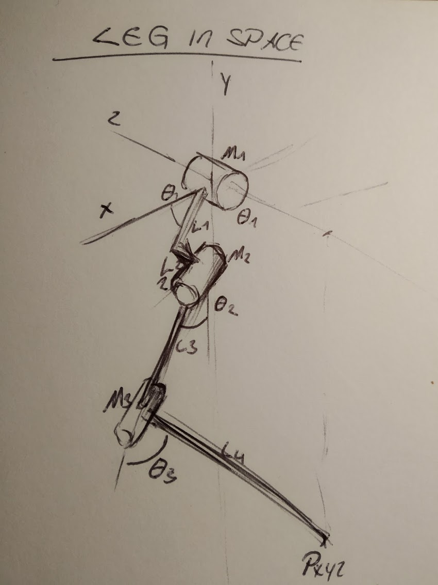
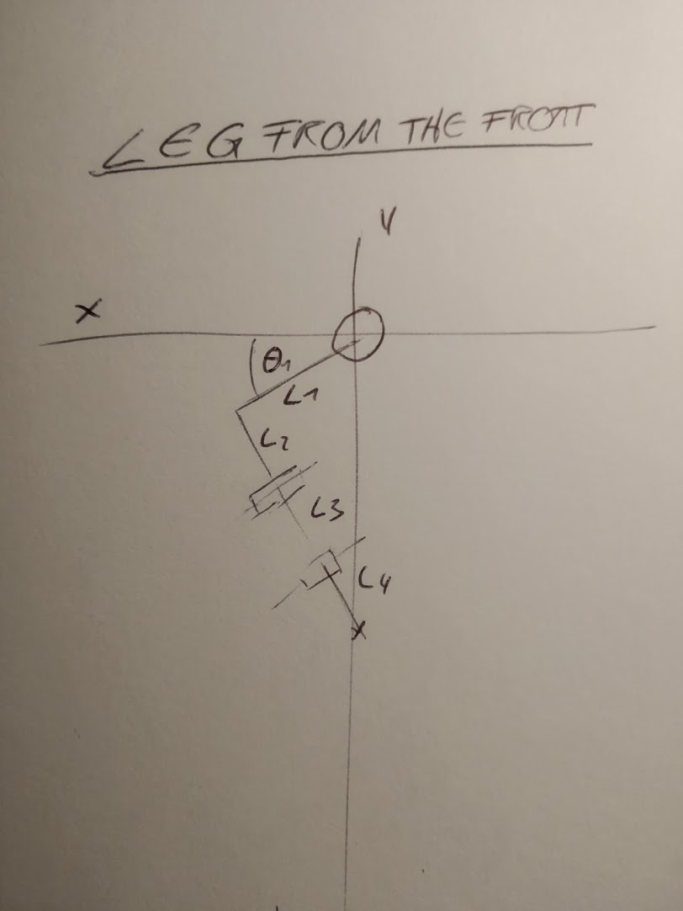
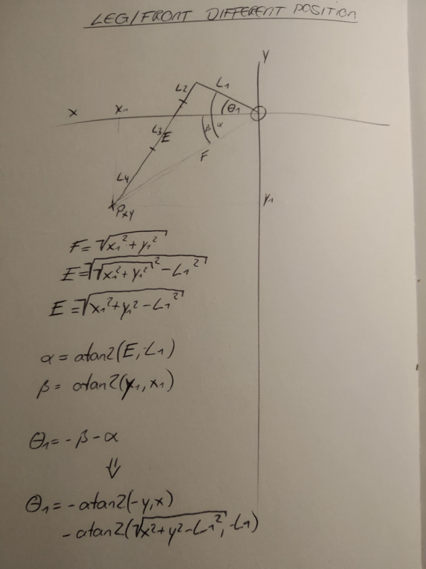

## Inverse Kinematics

See [this Page](https://www.ijstr.org/final-print/sep2017/Inverse-Kinematic-Analysis-Of-A-Quadruped-Robot.pdf) for more Information about Inverse Kinematics for quadruped Robots.
We will use this as a template / comparison for our own calculations, because
SpotMicro has some specialities which are not included a those formulas.

When you take a look at Fig. 2 you will notice, that the Leg used here is quite similar to 
SpotMicros Leg, but not really the same:

- the "Leg"-Motor/Rotation is on the same axis (z3) as the Shoulder-Motor/Rotation-Axis.
  SpotMicros Leg-Rotation is about 1cm lower, so we need an additional "L1b" which goes down (same direction as L2),
  but does not rotate with the Leg (L2,L3). Since we are completely recreating the calculations, i decided to go with
  L1-L4 instead of L1,L1b,L2,L3. 
- the "Foot"-joint is shifted by ~1cm to "the front" (pictures will follow). 

So, lets reconstruct the calculations used in this cool Paper above. 
Let's focus on the IK-Part.
So let's take a look at SpotMicro's Legs:

First of all lets focus on the shoulder-angle - omega1.
The Paper uses

omega1 = -atan2(-y,x) - atan2(sqrt(x**2+y**2-L1**2),-L1)

Let's discover that.
We need some kind of toolbelt for this mission.

### The "Pythagoras-Tool"

'''a**2+b**2=c**2'''

But keep in mind: This is only for triangles with the square-angle where c is the opposite edge.
So, if you want to know a or b (one of the edges touching the square-angle), you will use:

a**2=c**2-b**2 and b**2=c**2-a**2

and so 

c=sqrt(a**2+b**2)
a=sqrt(c**2-b**2) and b=sqrt(c**2-a**2)

### atan2(y,x) - get the angle

Please see [Wikipedia](https://en.wikipedia.org/wiki/Atan2). They did a great job in explaining it. 
alpha = atan2(y,x) not x,y! 

## omega1 

Lets take another position for the Leg:

If we could solve E and F, we could calculate the angles and we have omega1!

F is quite easy, as Pythagoras told us. And then E is quite easy too. Pythagoras again. 
Now we have a Triangle with L1,E and F, and it has a square-angle. Perfect for atan2!
So we calculate the whole angle alpha of the triangle and then substract the angle 
of the lower part by using atan2 again with -y and x. Great!

And now we have E. And E-L2 is "how long must the leg be (on X/Y only) to reach point Pxy".
We call it G. We say H is sqrt(G**2+z**2) and have the length (3D) our leg has to be.

## omega3

We know what length we need to reach with the leg and foot-joint. It's a simple triangle.
All sides are known. L3,L4 and H = sqrt(G**2+z**2)
Google "angles for triangle with all sides known" and you'll get:

acos( ( a^2 + b^2 - c^2 ) / (2ab) )  or similar

so we have 

omega3 = acos(L3**2+L4**2-sqrt((sqrt(x**2+y**2-L1**2)-L2)**2+z**2))/(2*L3*L4)

## omega2

